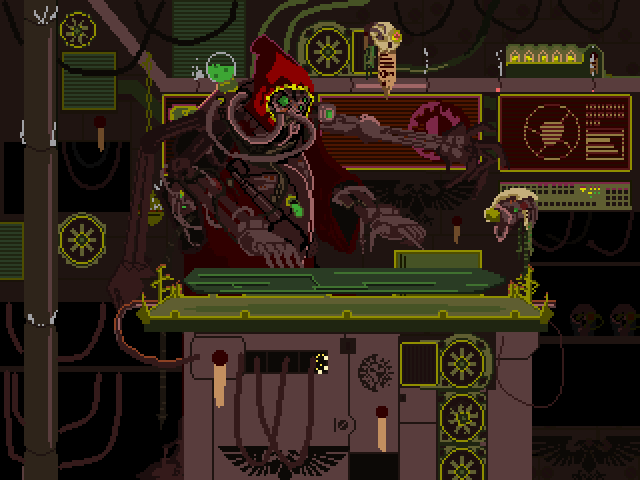

# ㅤㅤㅤㅤㅤㅤㅤㅤㅤㅤㅤПривет, я DedBuxtar 👋     
## Начну с краткой сводки о себе: 

⚡ Я начинающий программист интересующийся embedded системами

📜 В данный момент изучаю С++ а так же основы алгоритмов

🧠 Люблю решать задачи требующие неторопливого и вдумчивого подхода

🦾 Считаю что программист в первую очередь инженер а не менеджер

═══════════════════════════════════════════════════════════════════════════════

## Инструменты с которыми я работаю:

   

═══════════════════════════════════════════════════════════════════════════════

## Мои контакты:

почта: dedbuxtar@gmail.com, fa_r_2006@mail.ru
телеграмм: @Ded_Buxtar

═══════════════════════════════════════════════════════════════════════════════

